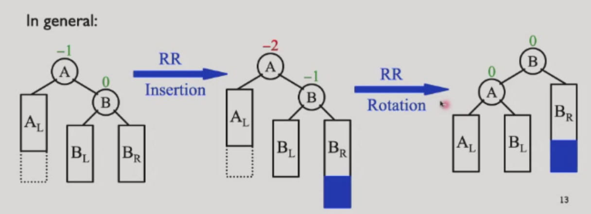
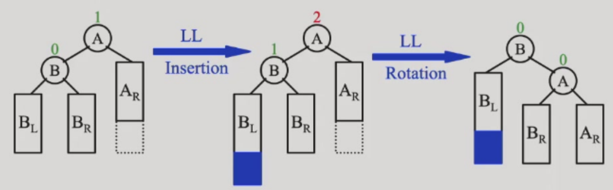
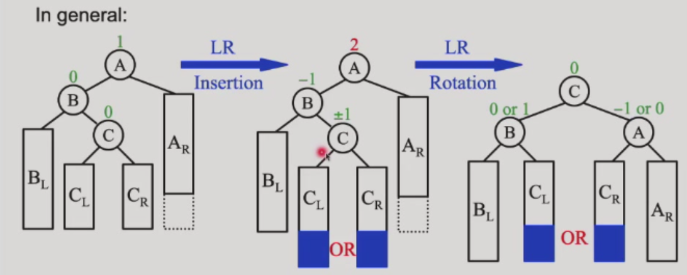
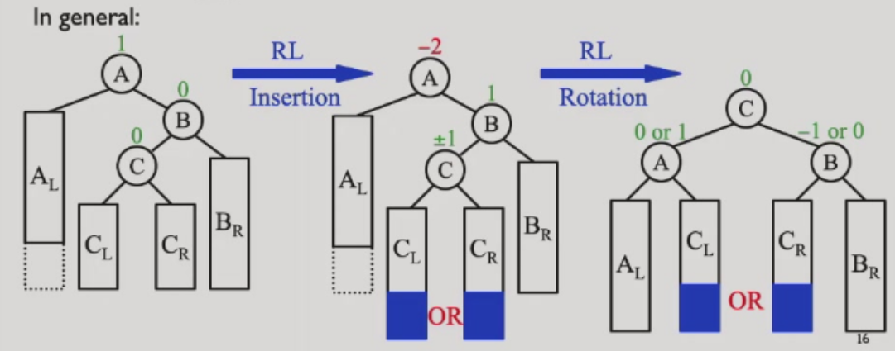
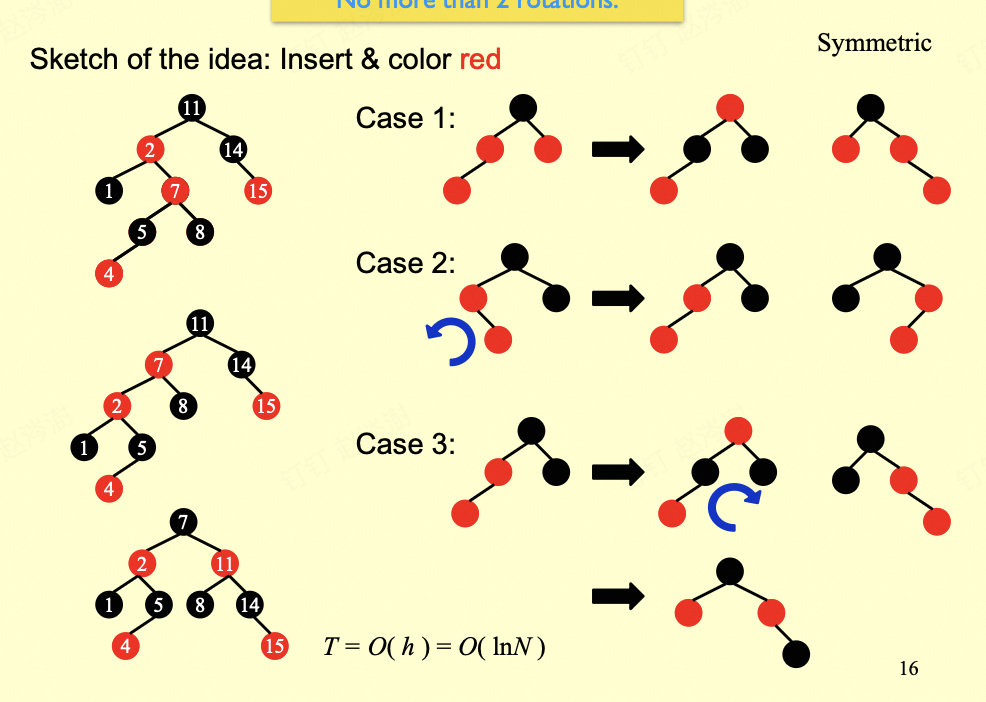
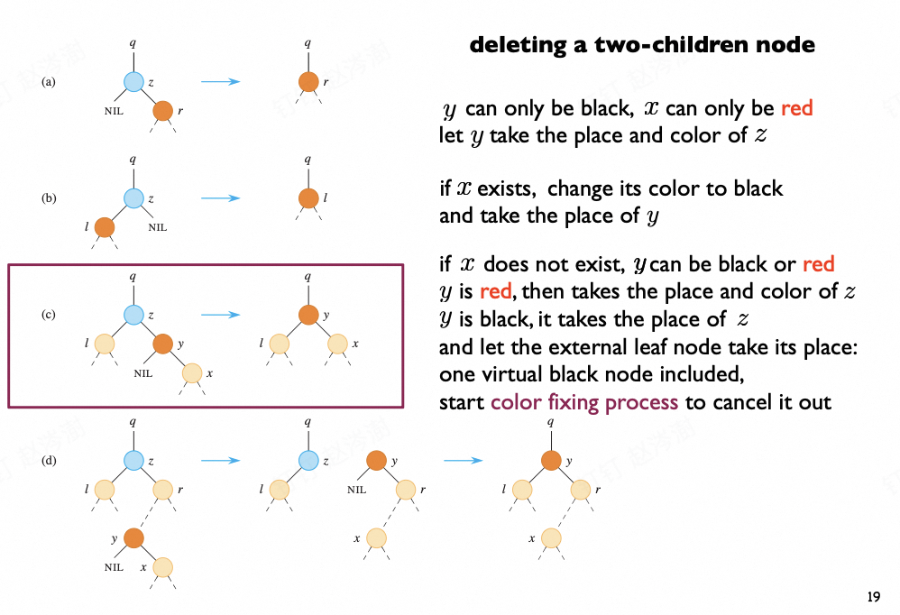
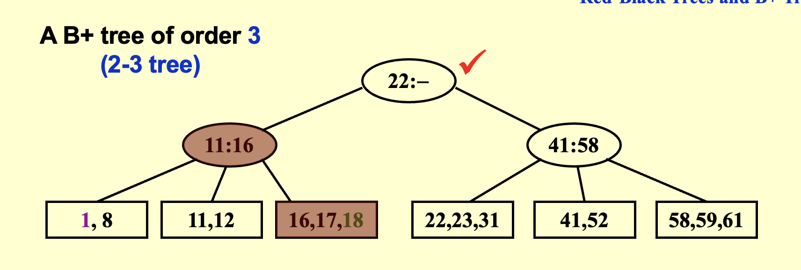
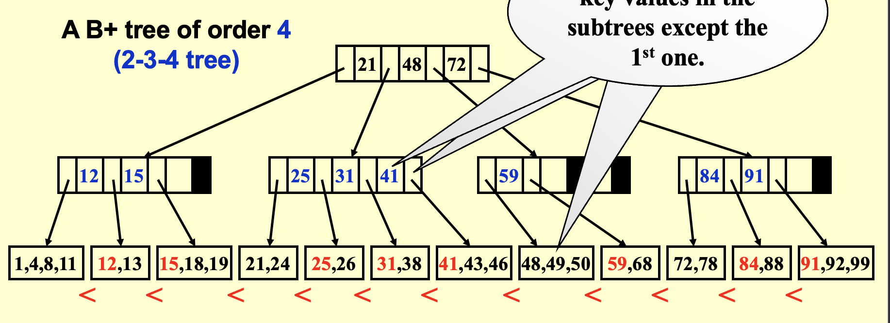
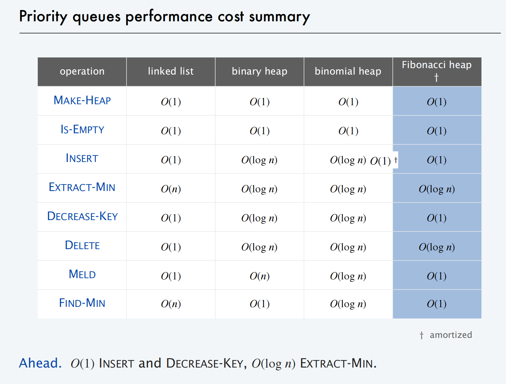

# 高级数据结构（ADS）  dyx

## lec1

## 平衡搜索树

### Binary Search Tree (BST)
树的操作与树的深度密切相关，最坏情况下深度为 n-1。

### Balanced BSTs
- 加速查找
- 避免最坏 O(N) 复杂度

## AVL 树（Adelson-Velskii-Landis Trees）

**高度平衡定义**：
1. 左右子树均为高度平衡树
2. 左右子树高度差 ≤ 1

**AVL 树定义**：平衡因子 BF(node) = h_left - h_right，AVL 树要求任意节点 BF ∈ {-1, 0, 1}。

**示例**：维护树的平衡，当某节点 BF 不满足时，进行一次旋转（single rotation）使其重新平衡。


#### RR 旋转


#### LL 旋转


#### LR 旋转


#### RL 旋转


关于 AVL 树的最坏情况。

just like Fibonacci numbers: N (h) = N (h-1) + N (h-2) + 1
也就是斐波那契数减去一。

由斐波那契数性质可得：

\[
    n_h = F_{h+3} - 1, \quad h \geq 0
\]

斐波那契数理论给出：

\[
    F_i \approx \frac{1}{\sqrt{5}} \left( \frac{1+\sqrt{5}}{2} \right)^i
\]

因此：

\[
    n_h \approx \frac{1}{\sqrt{5}} \left( \frac{1+\sqrt{5}}{2} \right)^{h+3} - 1
\]

\[
    \Rightarrow \quad h = O(\ln n)
\]

挺好的对数级复杂度 不赖/

## Splay Trees

amortized time is O(log N)
Idea: After a node is accessed ,it is pushed to the root by a series of AVL tree rotations.

the tendency goes to balance.

# lec2

## Amortized analysis 摊还分析

Target: Any M consecutive operationss take at most O(M logN) time.

exp：
i. two_stack O(1)
ii. Dynamic Arrays O(1)


### Accounting Method

### Potential Method

How to assign?

how "messy" the data structure is.(large-messy small-clean) 回味回味

'amortized-cost = real-cost + k * \Delta phi(keep it larger than zero)'

\Delta phi = phi after - phi before

exp:
i. phi = height of in stack
代入得到 amortized-cost = O(1) + k·1
全部移动过去的计算：=O(h) + k·-h //h= height of Instack    =O(1) #下降了
之后的pop只剩下 real-cost = O(1)

Why this works:
E amortized = E real-cost + k(phi end - phi start)

Then lts go to the proof of the splay tree

# lec3

## Red-Black trees

### introduction

M-ary Search Trees：search insert delete

Then Reduce 2-3-4 trees to BSTs:transform 3- and 4- nodes into 2- nodes(用二叉搜索树来模拟多叉搜索树)

`Red-black trees`
1. every node is either black or red
2. root is black
3. every leaf is black[通常指的是NULL的空节点]
4. if node is red then both children are black[红色的父与子都是黑色]
5. all simple paths from the node to descendant leaves contain the same number of black nodes.

[lemma]: with N internal nodes has height at most 2ln(N+1)

avl tree is more stricter and more efficient

proof: bh(tree) >= h(tree)/2

### insertion and deletion(想一下都觉得难，，)

看起来很大，但是转起来很省力，主要在于修改红黑,其实比avl简单听不懂（）

#### insert



1. 插入非根默认染红，若是根，则染成黑色

2. 若叔叔颜色是红色的，则进行儿-父染色互换，把爷作为新节点

3. 判断红色是否连接，根据siblings的颜色，若黑色则
    - LL：右单旋，父-爷染色
    - RR：左单旋，父-爷染色（取反就可以了）
    - LR：先左旋后右旋，儿-爷染色
    - RL：先右旋后左旋，儿-爷染色
（感觉是个递归，直到每一次插入都到达根）

#### delet（难）

deletion和bst的deletion差不多，color fixing process



1. 没有孩子--直接删除

2. 只有左孩子\右孩子--代替后变黑

3. 没有孩子
    - 红节点：直接删除
    - 黑节点：破坏了黑路同
        - 兄弟是黑色：
            - 至少一个红孩子：（LL（r变s，s变p，p变r），RR，LR（r变p，p变黑），RL）变色 + 旋转
            - 孩子都是黑的：兄弟变红，双黑上移，进入递归继续判断。是红节点，根则为单黑。
        - 兄弟是红色：兄-父变色，父朝双黑旋转。之后继续进行调整。

#### 考试原则上不会出红黑树o，，

some options of 2-3-4 trees:similar to the bst
(感觉一下就行 考试不考hhhh)

## B & B+ trees

### B 树（B-Tree）简介（这个不考）

B 树是一种自平衡的多路搜索树，广泛应用于数据库和文件系统中。其主要特点如下：

- **每个节点可以有多个子节点**，而不是二叉树的两个。（通常是叉数-1）
- **所有叶子节点都在同一层**，保证了树的平衡性。
- **节点包含多个关键字**，并按照关键字有序存储。
- **每个非叶子节点有 k 个子节点，包含 k-1 个关键字**，满足区间分割性质。
- **插入和删除操作会自动保持树的平衡**，通过节点的分裂和合并实现。

B 树的优点在于减少了磁盘 I/O 操作次数，适合存储大量数据的场景。常见的 B 树阶数为 3 或 4（即 2-3 树、2-3-4 树），实际应用中阶数通常更大。

### B+ 树（考这个）

internal nodes only contain indexs to help find the right leaf.This way can lead to larger 叉数。





#### Definition：
    1. the root is either a leaf or has between 2 and M children
    2. all nonleaf nodes have between M/2 and M nodes
    3. all leaves have the same depth.

#### Insertion

1. **Locate the Leaf Node**: Start from the root and use internal node indexes to find the target leaf node.
2. **Insert and Split**:
    - If the leaf node is not full (< M keys), insert the new key in order.
    - If the leaf node is full (= M keys):
        - Select the middle key (the ⌈(M+1)/2⌉-th key) as the "split key" and divide the leaf into two nodes.
        - Promote the split key to the parent node, which now points to the two new child nodes.
        - If the parent is also full, recursively split upwards; if the root splits, the tree height increases by one.
3. **Complexity**: Each insertion requires one downward search and at most one upward split, resulting in O(log N) time overall.

#### Deletion

1. **Locate and Delete**: Start from the root, find the leaf node containing the target key, and remove it (maintaining key order).
2. **Check Leaf Node Size**:
    - If the leaf node still has at least ⌈M/2⌉ keys, deletion is complete.
    - If the leaf node has fewer than ⌈M/2⌉ keys:
      - **Borrow from Sibling**: Try to borrow a key from an adjacent sibling (update the parent’s index key to maintain correct intervals).
      - **Merge with Sibling**: If siblings also have only ⌈M/2⌉ keys, merge the current node with a sibling and remove the corresponding index key from the parent.
      - **Recursive Repair**: If the parent now has too few keys (< ⌈M/2⌉), recursively repair up the tree. If the root becomes empty, remove it and decrease the tree height.
3. **Exam Note**: For assignments and exams, 2-3 trees and 2-3-4 trees are treated as B+ trees. By default, the allowed number of keys in leaf nodes equals the allowed number of children in internal nodes.

### 代码实现（基于hw2.c）

数据结构的设置
```c
typedef struct node {
    int a[3];//用于存储数据 分裂的时候需要4个
    int count;//数量
    int isLeaf;//判断是否是叶子
    struct node *children[4];//孩子指针
} node;
```

插入
```c

//insert函数
void insert(node **root, int k) {
    //根
    if (*root == NULL) {
        *root = new_node(1);
        (*root)->a[0] = k;
        (*root)->count = 1;
        return;
    }

    //提供参数以供插入
    int repeat = 0;
    int up = 0;
    node *newRight = NULL;

    //进行插入
    insert_rec(*root, k, &up,&repeat, &newRight);

    if(repeat==1)
        printf("Key %d is duplicated\n", k);

    //进行了分裂，创建一个新的根
    if (newRight) { 
        node *newRoot = new_node(0);
        newRoot->a[0] = up;//上推
        newRoot->count = 1;//根的数
        newRoot->children[0] = *root;//旧的根
        newRoot->children[1] = newRight;//新的右子
        *root = newRoot;
    }
}

void insert_rec(node *x, int k, int *up, int *repeat, node **newRight) {

    //如果根是叶子
    if (x->isLeaf) {

        //遍历比较
        for (int i = 0; i < x->count; i++) {
            if (x->a[i] == k) {
                *repeat = 1;
                return;
            }
        }

        int pos = 0;
        while (pos < x->count && x->a[pos] < k) {
            pos++;
        }

        //临时实现一个数组来存储
        int temp[4];
        for(int i = 0; i < pos; i++) 
            temp[i] = x->a[i];
        temp[pos] = k;

        for(int i = pos; i < x->count; i++) 
            temp[i+1] = x->a[i];

        int cnt = x->count + 1;

        //小于三个
        if (cnt <= 3) {
            for (int j = 0; j < cnt; j++) 
                x->a[j] = temp[j];
            x->count = cnt;
        } 
        //分裂
        else { 
            *newRight = new_node(1);
            //左边处理
            x->a[0] = temp[0]; 
            x->a[1] = temp[1];
            x->count = 2;
            
            //右边处理
            (*newRight)->a[0] = temp[2]; 
            (*newRight)->a[1] = temp[3];
            (*newRight)->count = 2;
            //上推
            *up = (*newRight)->a[0];
        }
        return 0;
    }

    //根
    int idx = 0;

    //先查找子节点
    while (idx < x->count && k >= x->a[idx]) {
        idx++;
    }

    //在子节点进行插入
    insert_rec(x->children[idx], k,up, repeat, newRight);

    //如果孩子没有分裂
    if (!*newRight) 
        return 0;

    //不然
    int b[3]; 
    node *tempchild[4]; 
    int i;

    //同上原理
    for (i = 0; i < idx; i++) 
        b[i] = x->a[i];
    b[idx] = *up;
    for (i = idx; i < x->count; i++) 
        b[i+1] = x->a[i];

    for (i = 0; i <= idx; i++) 
        tempchild[i] = x->children[i];
    
    tempchild[idx+1] = *newRight;

    for (i = idx+1; i <= x->count; i++) 
        tempchild[i+1] = x->children[i];

    int count2 = x->count + 1;

    //再检查上移位置是否已满
    if (count2 <= 2) {
        for (i = 0; i < count2; i++)
            x->a[i] = b[i];
        for (i = 0; i <= count2; i++) 
            x->children[i] = tempchild[i];
        
        x->count = count2;
        *up = 0; 
        *newRight = NULL;
    } 
    //反之分裂同上
    else {
        *newRight = new_node(0);
        x->a[0] = b[0]; 
        x->count = 1;
        x->children[0] = tempchild[0]; 
        x->children[1] = tempchild[1];
        x->children[2] = x->children[3] = NULL;
        (*newRight)->a[0] = b[2]; 
        (*newRight)->count = 1;
        (*newRight)->children[0] = tempchild[2]; 
        (*newRight)->children[1] = tempchild[3];
        
        //上推
        *up = b[1];
    }
}

```

## Take-home messages

### Red-black trees:
 - Binary search tree version of 2-3-4 trees. The red nodes are for 
represent >2 branches in each node.
 - The major properties lie in that the black height is balanced for 
each node.
 - The insertion and deletion involve constant cost on rotations.

### B & B+ trees:
 - Search trees with more branches. Suitable for reducing access 
 - cost on nodes, applications on database, secondary drives…
 - Reduce tree depth by increasing the number of branches.

# lec4

## Priority queues

### Review of binary heaps(其实我全忘了嘻嘻)

Complete tree:Perfectly balanced.
key in child >= key in parent 小根堆.

### Leftist heaps(左斜堆) 

speed up merging.

[定义] 空路径长度（null path length，Npl(X)）是指从节点 X 出发，沿着其子节点一直走到遇到没有两个孩子的节点（即至少有一个孩子为 NULL）所经过的最短路径长度。对于空节点（NULL），规定 Npl(NULL) = –1。 

[定义]左斜堆的性质是：对于堆中的每个节点 X，其左孩子的空路径长度（null path length）>= 右孩子的空路径长度。

右子树r，总共至少有2的r次-1.

```
struct TreeNode 
{ 
ElementType Element; 
PriorityQueue Left; 
PriorityQueue Right; 
int Npl; 
} ;
```

Merge 其实就是递归实现（开什么玩笑怎么有点难，，，，
```
PriorityQueue Merge ( PriorityQueue H1, PriorityQueue H2 ) 
{ 
if ( H1 == NULL ) return H2;
if ( H2 == NULL ) return H1;
if ( H1->Element < H2->Element ) return Merge1( H1, H2 ); 
else return Merge1( H2, H1 ); 
}
```

### Skew heaps（斜堆）

不适合递归！

Merge: Always swap the left and right children except that the 
largest of all the nodes on the right paths does not 
have its children swapped. No Npl.

It is an open problem to determine precisely the expected right 
path length of both leftist and skew heaps.

### Binomial Queues(优化skewheaps的插入操作)

定义：二项队列不是堆序树，而是一组堆序树的集合，被称为森林。每棵堆序树都是一棵二项树。

类似于二进制处理


### Comparison




### Take-Home Messages

#### Leftist heaps:
• Reduce merge cost to O(log N) by building unbalanced heaps, and put all the computation on the right (light) paths.

#### Skew heaps: 
• Avoiding skewness checking by always flipping left and right. Guarantee amortized cost O(log N).

#### Binomial queues:
• Improve the amortized cost of insertion into O(1). Using the idea of binary counter addition.

#### Comparison

