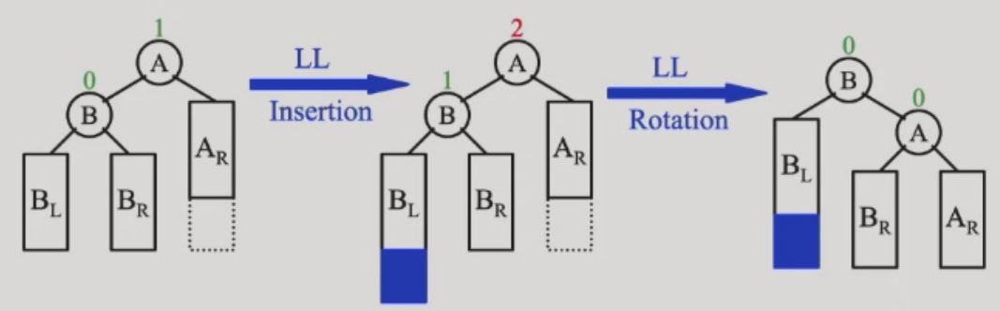
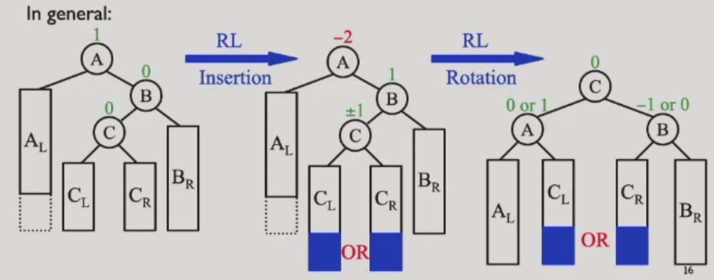
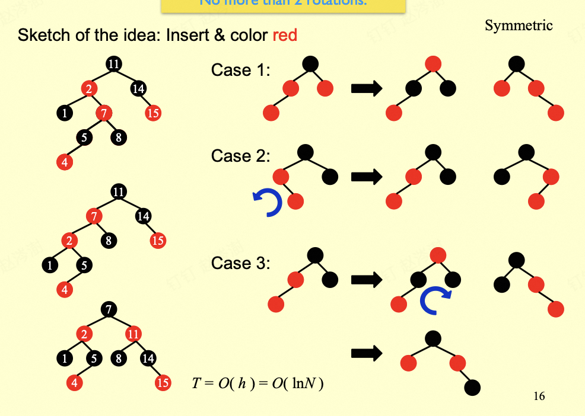
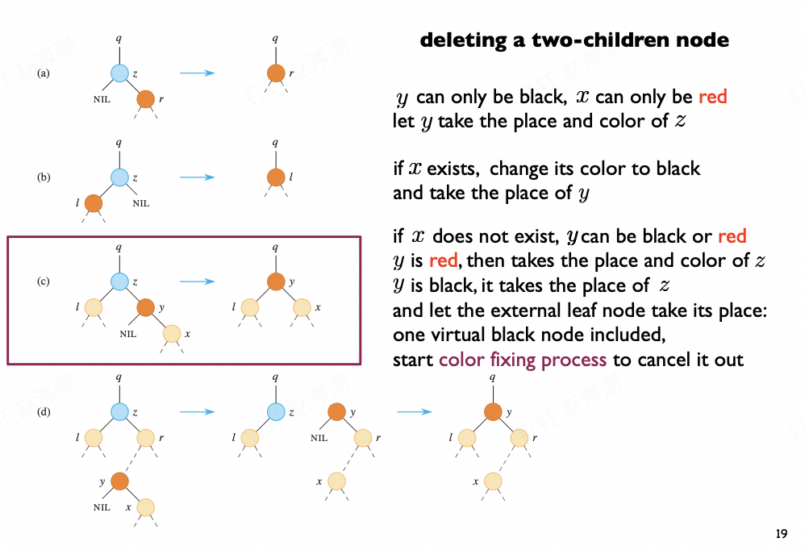

# 高级数据结构（ADS）  dyx

# lec1

## 平衡搜索树

### Binary Search Tree (BST)
树的操作与树的深度密切相关，最坏情况下深度为 n-1。

### Balanced BSTs
- 加速查找
- 避免最坏 O(N) 复杂度

## AVL 树（Adelson-Velskii-Landis Trees）

**高度平衡定义**：
1. 左右子树均为高度平衡树
2. 左右子树高度差 ≤ 1

**AVL 树定义**：平衡因子 BF(node) = h_left - h_right，AVL 树要求任意节点 BF ∈ {-1, 0, 1}。

**示例**：维护树的平衡，当某节点 BF 不满足时，进行一次旋转（single rotation）使其重新平衡。

#### RR 旋转

#### LL 旋转

#### LR 旋转

#### RL 旋转

关于 AVL 树的最坏情况。

just like Fibonacci numbers: N (h) = N (h-1) + N (h-2) + 1
也就是斐波那契数减去一。

由斐波那契数性质可得：

\[
    n_h = F_{h+3} - 1, \quad h \geq 0
\]

斐波那契数理论给出：

\[
    F_i \approx \frac{1}{\sqrt{5}} \left( \frac{1+\sqrt{5}}{2} \right)^i
\]

因此：

\[
    n_h \approx \frac{1}{\sqrt{5}} \left( \frac{1+\sqrt{5}}{2} \right)^{h+3} - 1
\]

\[
    \Rightarrow \quad h = O(\ln n)
\]

挺好的对数级复杂度 不赖/

## Splay Trees

amortized time is O(log N)
Idea: After a node is accessed ,it is pushed to the root by a series of AVL tree rotations.

the tendency goes to balance.

# lec2

## Amortized analysis 摊还分析

Target: Any M consecutive operationss take at most O(M logN) time.

exp：
i. two_stack O(1)
ii. Dynamic Arrays O(1)

### Accounting Method

### Potential Method

How to assign?

how "messy" the data structure is.(large-messy small-clean) 回味回味

'amortized-cost = real-cost + k * \Delta phi(keep it larger than zero)'

\Delta phi = phi after - phi before

exp:
i. phi = height of in stack
代入得到 amortized-cost = O(1) + k·1
全部移动过去的计算：=O(h) + k·-h //h= height of Instack    =O(1) #下降了
之后的pop只剩下 real-cost = O(1)

Why this works:
E amortized = E real-cost + k(phi end - phi start)

Then lts go to the proof of the splay tree

# lec3

## Red-Black trees

### introduction

M-ary Search Trees：search insert delete

Then Reduce 2-3-4 trees to BSTs:transform 3- and 4- nodes into 2- nodes(用二叉搜索树来模拟多叉搜索树)

`Red-black trees`
1. every node is either black or red
2. root is black
3. every leaf is black[通常指的是NULL的空节点]
4. if node is red then both children are black[红色的父与子都是黑色]
5. all simple paths from the node to descendant leaves contain the same number of black nodes.

[lemma]: with N internal nodes has height at most 2ln(N+1)

avl tree is more stricter and more efficient

proof: bh(tree) >= h(tree)/2

### insertion and deletion(想一下都觉得难，，)

看起来很大，但是转起来很省力，主要在于修改红黑,其实比avl简单听不懂（）

#### insert

1. 插入非根默认染红，若是根，则染成黑色

2. 若叔叔颜色是红色的，则进行儿-父染色互换，把爷作为新节点

3. 判断红色是否连接，根据siblings的颜色，若黑色则
    - LL：右单旋，父-爷染色
    - RR：左单旋，父-爷染色（取反就可以了）
    - LR：先左旋后右旋，儿-爷染色
    - RL：先右旋后左旋，儿-爷染色
（感觉是个递归，直到每一次插入都到达根）

#### delet

deletion和bst的deletion差不多，color fixing process

1. 没有孩子--直接删除

2. 只有左孩子\右孩子--代替后变黑

3. 没有孩子
    - 红节点：直接删除
    - 黑节点：破坏了黑路同
        - 兄弟是黑色：
            - 至少一个红孩子：（LL（r变s，s变p，p变r），RR，LR（r变p，p变黑），RL）变色 + 旋转
            - 孩子都是黑的：兄弟变红，双黑上移，进入递归继续判断。是红节点，根则为单黑。
        - 兄弟是红色：兄-父变色，父朝双黑旋转。之后继续进行调整。

#### 考试原则上不会出红黑树o，，

some options of 2-3-4 trees:similar to the bst
(感觉一下就行 考试不考hhhh)

## B & B+ trees

### B 树（B-Tree）简介（这个不考）

B 树是一种自平衡的多路搜索树，广泛应用于数据库和文件系统中。其主要特点如下：

- **每个节点可以有多个子节点**，而不是二叉树的两个。（通常是叉数-1）
- **所有叶子节点都在同一层**，保证了树的平衡性。
- **节点包含多个关键字**，并按照关键字有序存储。
- **每个非叶子节点有 k 个子节点，包含 k-1 个关键字**，满足区间分割性质。
- **插入和删除操作会自动保持树的平衡**，通过节点的分裂和合并实现。

B 树的优点在于减少了磁盘 I/O 操作次数，适合存储大量数据的场景。常见的 B 树阶数为 3 或 4（即 2-3 树、2-3-4 树），实际应用中阶数通常更大。

### B+ 树（考这个）

internal nodes only contain indexs to help find the right leaf.This way can lead to larger 叉数。

#### Definition：
    1. the root is either a leaf or has between 2 and M children
    2. all nonleaf nodes have between M/2 and M nodes
    3. all leaves have the same depth.

#### Insertion

1. **Locate the Leaf Node**: Start from the root and use internal node indexes to find the target leaf node.
2. **Insert and Split**:
    - If the leaf node is not full (< M keys), insert the new key in order.
    - If the leaf node is full (= M keys):
        - Select the middle key (the ⌈(M+1)/2⌉-th key) as the "split key" and divide the leaf into two nodes.
        - Promote the split key to the parent node, which now points to the two new child nodes.
        - If the parent is also full, recursively split upwards; if the root splits, the tree height increases by one.
3. **Complexity**: Each insertion requires one downward search and at most one upward split, resulting in O(log N) time overall.

#### Deletion

1. **Locate and Delete**: Start from the root, find the leaf node containing the target key, and remove it (maintaining key order).
2. **Check Leaf Node Size**:
    - If the leaf node still has at least ⌈M/2⌉ keys, deletion is complete.
    - If the leaf node has fewer than ⌈M/2⌉ keys:
      - **Borrow from Sibling**: Try to borrow a key from an adjacent sibling (update the parent’s index key to maintain correct intervals).
      - **Merge with Sibling**: If siblings also have only ⌈M/2⌉ keys, merge the current node with a sibling and remove the corresponding index key from the parent.
      - **Recursive Repair**: If the parent now has too few keys (< ⌈M/2⌉), recursively repair up the tree. If the root becomes empty, remove it and decrease the tree height.
3. **Exam Note**: For assignments and exams, 2-3 trees and 2-3-4 trees are treated as B+ trees. By default, the allowed number of keys in leaf nodes equals the allowed number of children in internal nodes.
## Take-home messages

### Red-black trees:
 - Binary search tree version of 2-3-4 trees. The red nodes are for 
represent >2 branches in each node.
 - The major properties lie in that the black height is balanced for 
each node.
 - The insertion and deletion involve constant cost on rotations.

### B & B+ trees:
 - Search trees with more branches. Suitable for reducing access 
 - cost on nodes, applications on database, secondary drives…
 - Reduce tree depth by increasing the number of branches.