# 计算机系统II

# lec2

## Design of pipeline
Overlapping execution

The difference between stages (IF - ID - EX) may cause time consumption or resource competition.

- 一次重叠（partial overlap）：在解码第 k 条指令时开始执行第 k+1 条指令。可以缩短总体耗时，但会使控制逻辑更复杂。
- 二次重叠（further overlap）：在执行第 k 条指令时并行处理第 k+1 条指令。

为了解决内存访问冲突（例如 instruction cache 与 data cache 共享，或指令存储器 imem 与数据存储器 dmem 冲突），可以在主存控制器与指令译码单元之间增加指令缓冲区（instruction buffer）。
缓冲区可以临时存放多条取出的指令，降低取指与访存之间的冲突，从而减少流水线停顿。

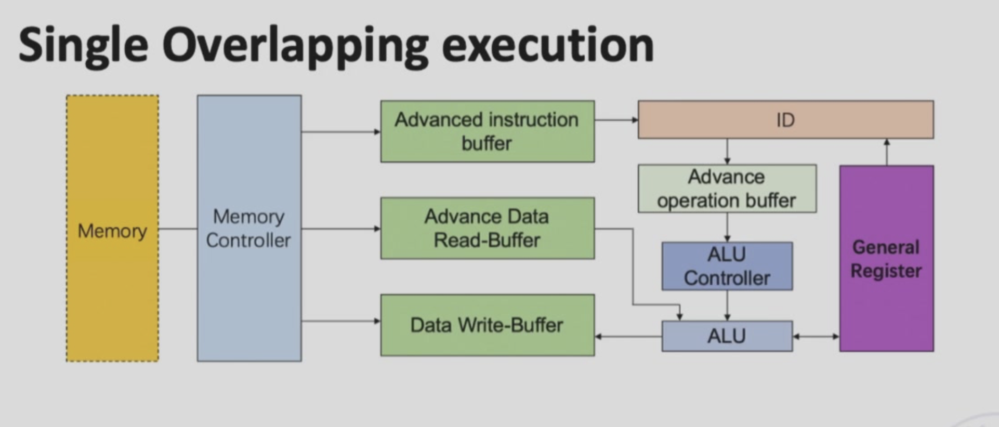

buffer在进入与排空的时候一定会存在时间的浪费。

SCPU里并不是所有的指令都会用到五个阶段，于此存在部分浪费。

## Classes of pipelining

- single function

- multi function
 - static:切换功能的时候必须要排空
 - dynamic:同时可以执行两种功能（看看都难）

- 线性流水线：各阶段串联连接且无反馈回路。数据流经每个阶段时，每个阶段最多只能进行一次传输。

- 非线性流水线：除串联连接外，还设有反馈回路。避免产生冲突

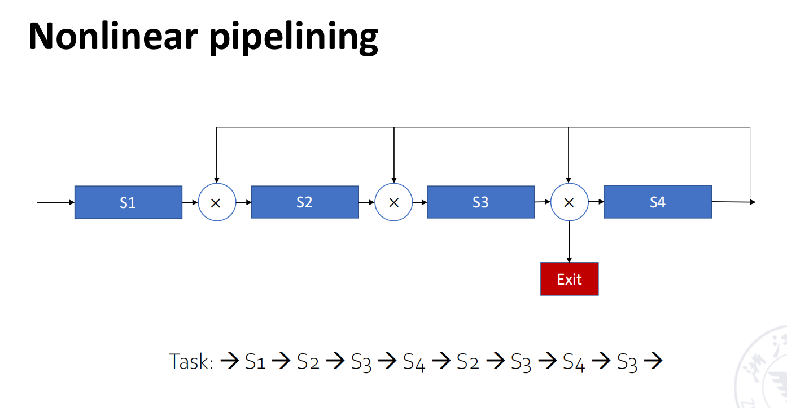

## An Inplementation of pipelining cpu(risc-v)


### understand how pipelined datapath work

#### load/store instruction

- store指令也把指令存入寄存器中

- 随着流水线的进行，load指令的返回地址可能已经被后续的指令改写，我们需要把原先pc也要通过中间寄存器进行传递，这样可以保证写回地址的正确性。

那么优化可以得到cpu。

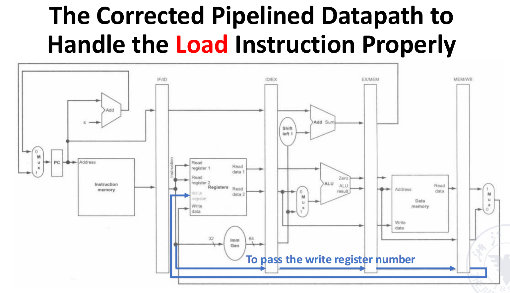

#### control signals
| 信号名称   | 未断言（0）效果                              | 断言（1）效果                                        |
|------------|---------------------------------------------|-----------------------------------------------------|
| RegWrite   | 不执行任何寄存器写操作                      | 将“写数据”写入指令指定的目标寄存器（由 IR 的 rd 字段确定）|
| ALUSrc     | ALU 的第二个操作数来自寄存器读数据 2        | ALU 的第二个操作数来自指令的 12 位符号扩展立即数      |
| PCSrc      | PC 更新为当前 PC + 4（顺序执行）            | PC 更新为分支目标地址（由 EX 阶段 ALU 计算得出）      |
| MemRead    | 不读取数据内存内容                          | 按输入地址读取数据内存，将结果输出到“Read data”端     |
| MemWrite   | 不修改数据内存内容                          | 按输入地址将“写数据”（来自 Read data 2）写入数据内存  |
| MemtoReg   | 寄存器写回数据来自 ALU 输出（ALUOutput）    | 寄存器写回数据来自数据内存的读结果（Read data）       |

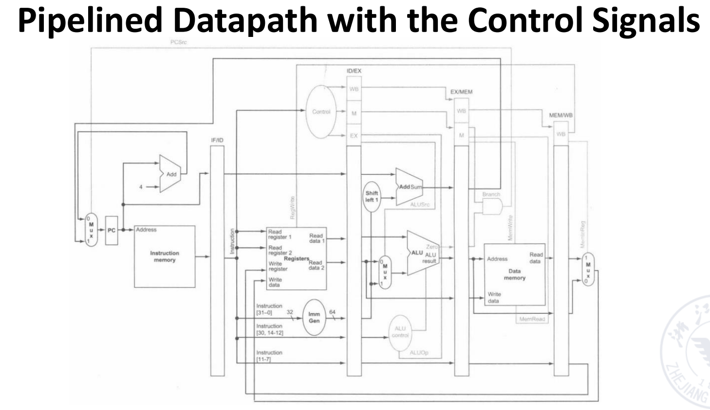

## Performance evaluation of pipelining

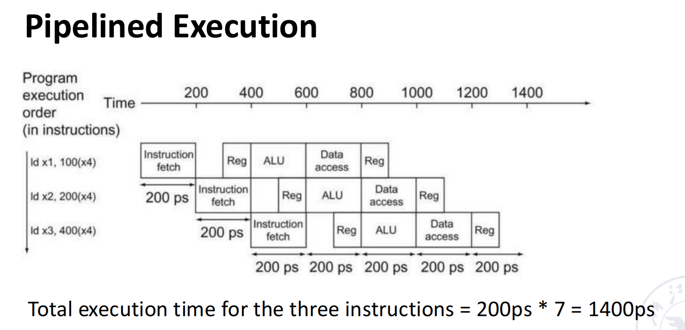

### **Throughpu(TP)**

#### 一、TP的核心定义与本质
吞吐量（Throughput，简称TP）是衡量流水线性能的核心指标，指**单位时间内流水线能够完成的指令或计算任务数量**

$$TP = \frac{n}{T}$$

其中，\(n\) 代表完成的指令（或任务）总数，\(T\) 代表完成 \(n\) 个指令（或任务）的总执行时间。

完成 \(n\) 个指令的总时间由两部分构成,第一句语句的加载（m），和后续（n-1）个语句的运行。

因此，总执行时间公式为：  

$$T = (m + n - 1) \times \Delta t_0$$

- 理想流水线的TP公式：将总执行时间代入TP核心公式，可得  
  $$TP = \frac{n}{(m + n - 1) \times \Delta t_0}$$  
- 最大吞吐量（\(TP_{max}\)）：当指令总数 \(n \gg m\)（指令数远大于流水线阶段数）时，\(m\) 和 \(-1\) 可忽略，此时 \(TP\) 无限接近 \(TP_{max}\)，且 \(TP_{max}\) 由单阶段时间决定：  
  $$TP_{max} = \frac{1}{\Delta t_0}$$  
- 实际TP与 \(TP_{max}\) 的关联：通过公式变形可明确两者的比例关系，即  
  $$TP = \frac{n}{n + m - 1} \times TP_{max}$$

例如，在前文示例中可给出一些常见量化值（仅示例）:


#### solve pipeline bottleneck

- subdivision
- repetition 
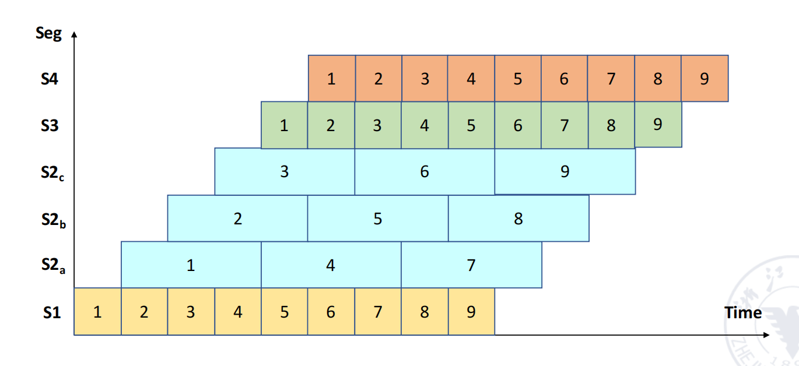

### **Speedup(sp)** --加速比

### Speedup (Sp) 与效率 (η)

速度加速比：
$$
Sp = \frac{n \times m \times \Delta t_0}{(m + n - 1)\times \Delta t_0}
= \frac{n\,m}{m + n - 1}
$$

流水线效率（每阶段平均利用率）：
$$
\eta = \frac{Sp}{m}
= \frac{\dfrac{n\,m}{m + n - 1}}{m}
= \frac{n}{m + n - 1}
$$

当 n \gg m 时，Sp \to m，\eta \to 1（接近理想情况）。


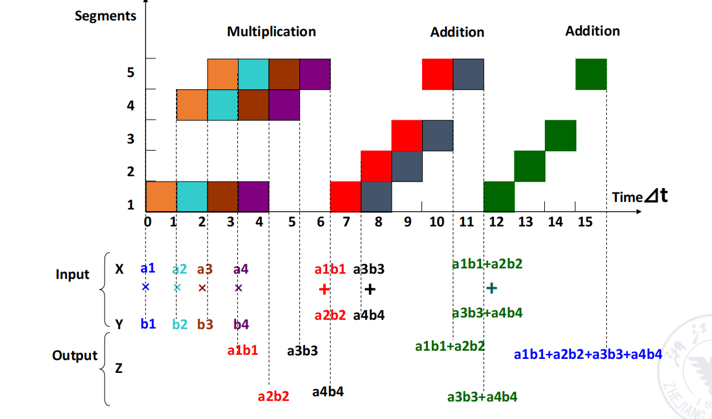

$$T_p = \frac{7}{15}\,\Delta t$$

$$S_p = \frac{4\cdot 3\,\Delta t + 3\cdot 4\,\Delta t}{15\,\Delta t} = 1.6$$

$$\eta = \frac{3\times 4\,\Delta t + 4\times 3\,\Delta t}{5\times 15\,\Delta t} = 32\%$$

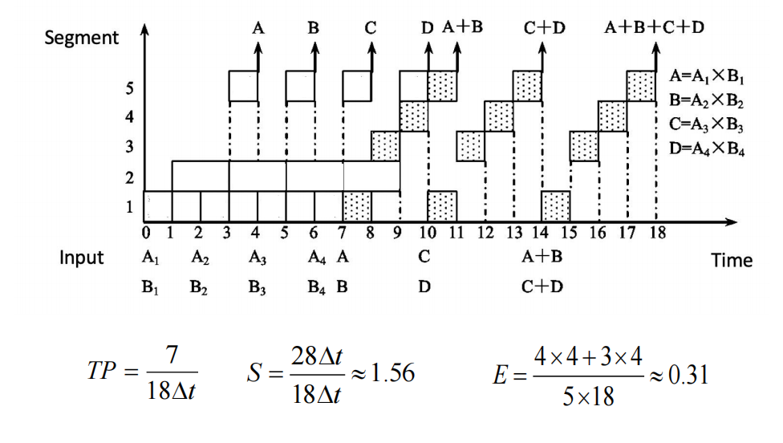

# lec3

Increasing instruction throughput (并行性)

## Hazards of pipelining

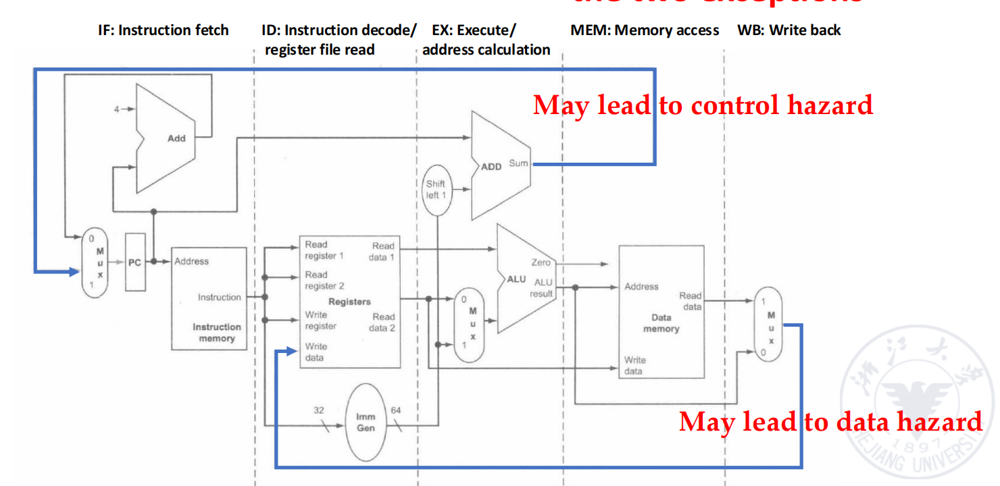
### stuctural hazard

A required resource is busy.

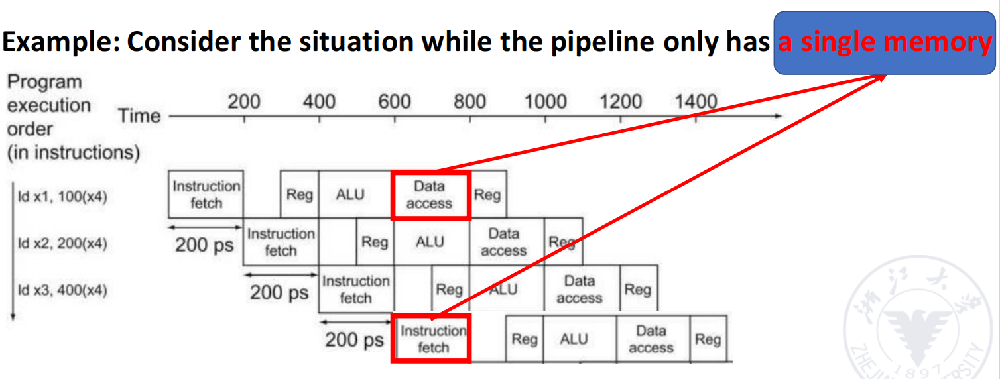

- Solution 1: Instructions take it in turns to use resource, some instructions have to stall

- Solution 2: Add more hardware to machine

### data hazards

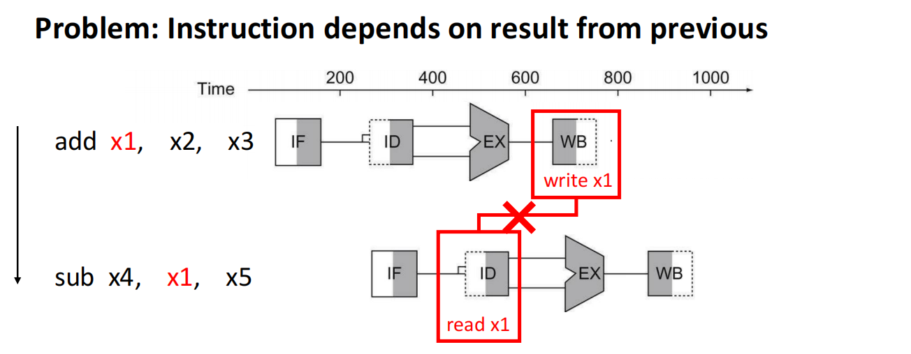

#### forwarding

Adding extra hardware to retrieve the missing item early from the internal resources

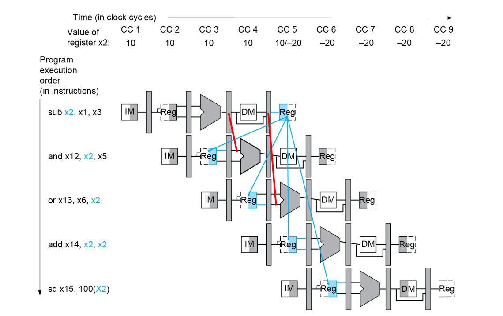

##### forwardingpath

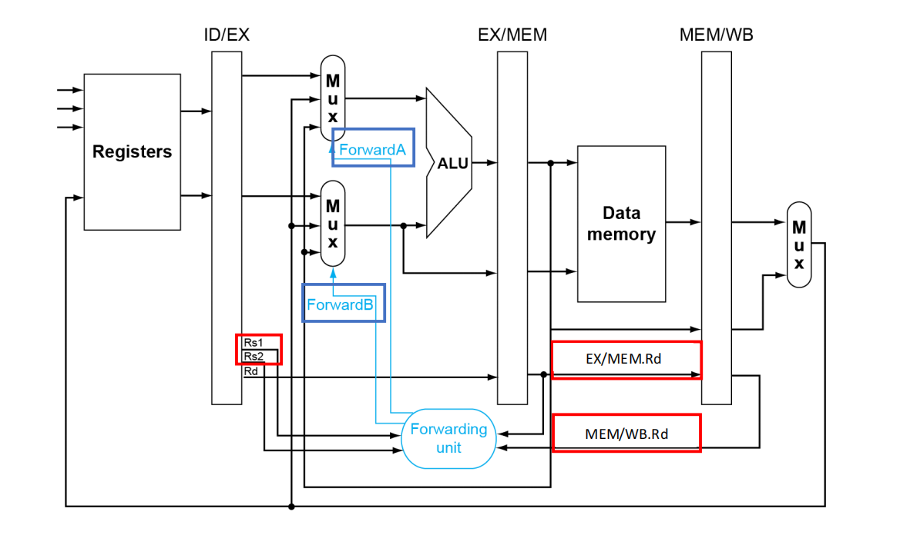

##### forwarding conditions

| 信号       | 状态 | 操作数来源          | 说明                                     |
|------------|------|---------------------|------------------------------------------|
| ForwardA   | 00   | ID/EX寄存器         | 来自寄存器堆的原始值                     |
| ForwardA   | 10   | EX/MEM寄存器        | 前一条指令的ALU结果（未写回寄存器堆）    |
| ForwardA   | 01   | MEM/WB寄存器        | 更早指令的结果（内存数据或早期ALU结果）  |
| ForwardB   | 00   | ID/EX寄存器         | 来自寄存器堆的原始值                     |
| ForwardB   | 10   | EX/MEM寄存器        | 前一条指令的ALU结果（未写回寄存器堆）    |
| ForwardB   | 01   | MEM/WB寄存器        | 更早指令的结果（内存数据或早期ALU结果）  |

#### Double Data hazard

```asm
add x1,x1,x2
add x1,x1,x3
add x1,x1,x4
```

#### Load-Use Hazard

```
lw x1, 0(x2)   # MEM阶段末尾才获取x1的值
add x3, x1, x4 # EX阶段需x1，前推无法及时提供
```
由此我们需要引入stall机制再加上forwarding来实现。

### Pipelining with stall

--NOP

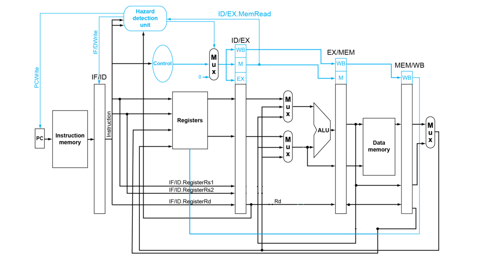


### control hazards

flow of excution depends on previous instruction.

Problem:THe conditional brach instruction

#### Branch hazards

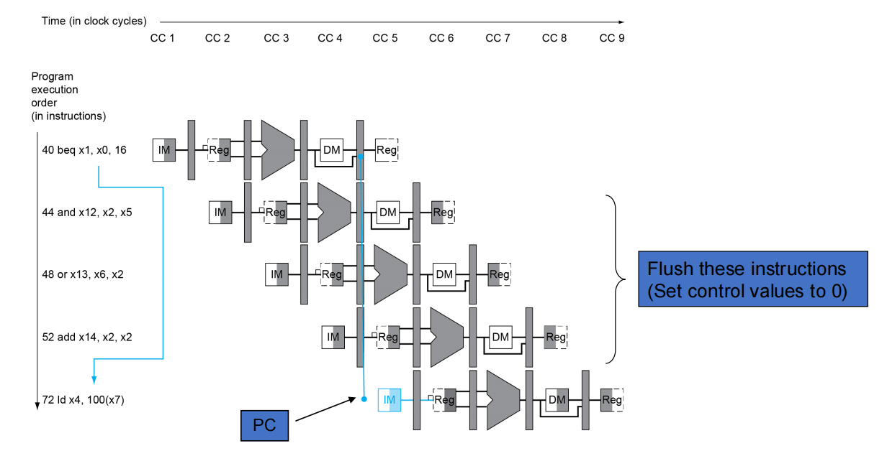

beq的结果我们需要等到运行到第三阶段才能得到，于是我们浪费了3 clock cycles。


