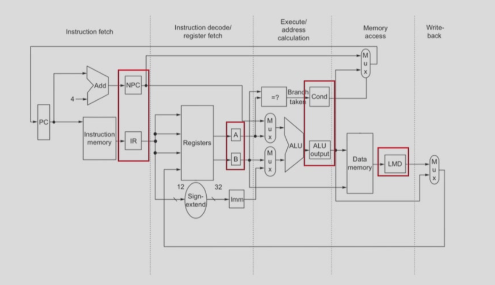

# 计算机系统II

## Design of pipeline
Overlapping execution

The difference between stages (IF - ID - EX) may cause time consumption or resource competition.

- 一次重叠（partial overlap）：在解码第 k 条指令时开始执行第 k+1 条指令。可以缩短总体耗时，但会使控制逻辑更复杂。
- 二次重叠（further overlap）：在执行第 k 条指令时并行处理第 k+1 条指令。

为了解决内存访问冲突（例如 instruction cache 与 data cache 共享，或指令存储器 imem 与数据存储器 dmem 冲突），可以在主存控制器与指令译码单元之间增加指令缓冲区（instruction buffer）。
缓冲区可以临时存放多条取出的指令，降低取指与访存之间的冲突，从而减少流水线停顿。

buffer在进入与排空的时候一定会存在时间的浪费。

SCPU里并不是所有的指令都会用到五个阶段，于此存在部分浪费。

## Classes of pipelining

### single function

### multi function
 - static:切换功能的时候必须要排空
 - dynamic:同时可以执行两种功能（看看都难）

## Inplementation of pipelining cpu(risc-v)

