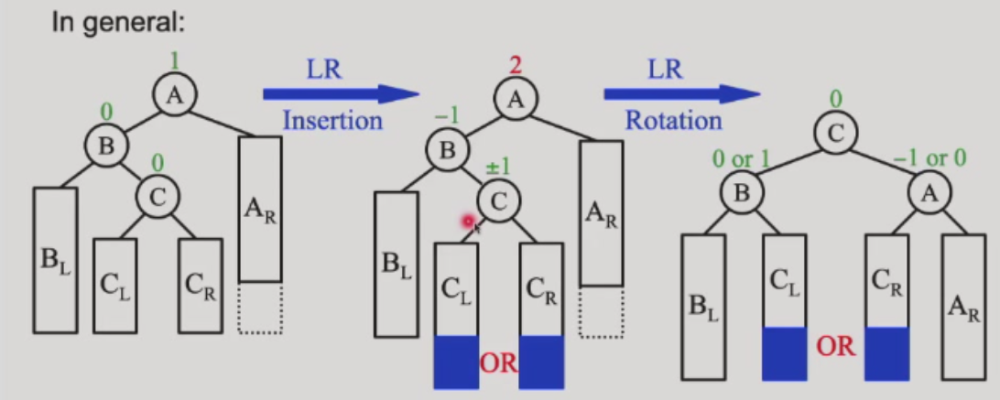

# 高级数据结构（ADS）

# lec1

## 平衡搜索树

### Binary Search Tree (BST)
树的操作与树的深度密切相关，最坏情况下深度为 n-1。

### Balanced BSTs
- 加速查找
- 避免最坏 O(N) 复杂度

## AVL 树（Adelson-Velskii-Landis Trees）

**高度平衡定义**：
1. 左右子树均为高度平衡树
2. 左右子树高度差 ≤ 1

**AVL 树定义**：平衡因子 BF(node) = h_left - h_right，AVL 树要求任意节点 BF ∈ {-1, 0, 1}。

**示例**：维护树的平衡，当某节点 BF 不满足时，进行一次旋转（single rotation）使其重新平衡。

#### RR 旋转

#### LL 旋转

#### LR 旋转

#### RL 旋转

关于 AVL 树的最坏情况。

just like Fibonacci numbers: N (h) = N (h-1) + N (h-2) + 1
也就是斐波那契数减去一。

由斐波那契数性质可得：

\[
    n_h = F_{h+3} - 1, \quad h \geq 0
\]

斐波那契数理论给出：

\[
    F_i \approx \frac{1}{\sqrt{5}} \left( \frac{1+\sqrt{5}}{2} \right)^i
\]

因此：

\[
    n_h \approx \frac{1}{\sqrt{5}} \left( \frac{1+\sqrt{5}}{2} \right)^{h+3} - 1
\]

\[
    \Rightarrow \quad h = O(\ln n)
\]

挺好的对数级复杂度 不赖/

## Splay Trees

amortized time is O(log N)
Idea: After a node is accessed ,it is pushed to the root by a series of AVL tree rotations.

the tendency goes to balance.

# lec2

## Amortized analysis 摊还分析

Target: Any M consecutive operationss take at most O(M logN) time.

exp：
i. two_stack O(1)
ii. Dynamic Arrays O(1)

### Accounting Method

### Potential Method

How to assign?

how "messy" the data structure is.(large-messy small-clean) 回味回味

'amortized-cost = real-cost + k * \Delta phi(keep it larger than zero)'

\Delta phi = phi after - phi before

exp:
i. phi = height of in stack
代入得到 amortized-cost = O(1) + k·1
全部移动过去的计算：=O(h) + k·-h //h= height of Instack    =O(1) #下降了
之后的pop只剩下 real-cost = O(1)

Why this works:
E amortized = E real-cost + k(phi end - phi start)

Then lts go to the proof of the splay tree

# lec3

