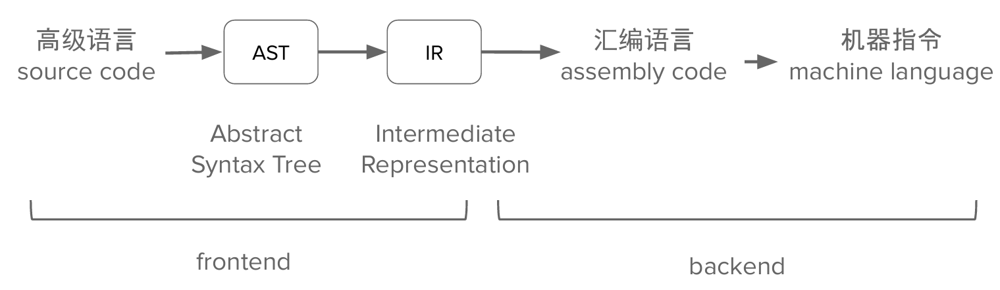
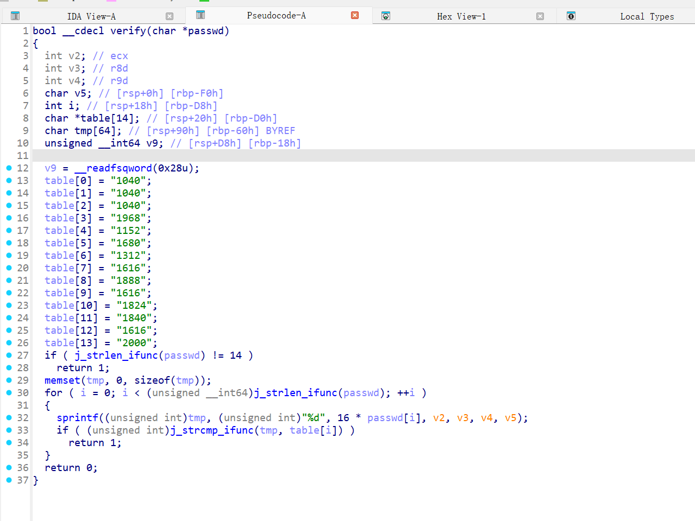
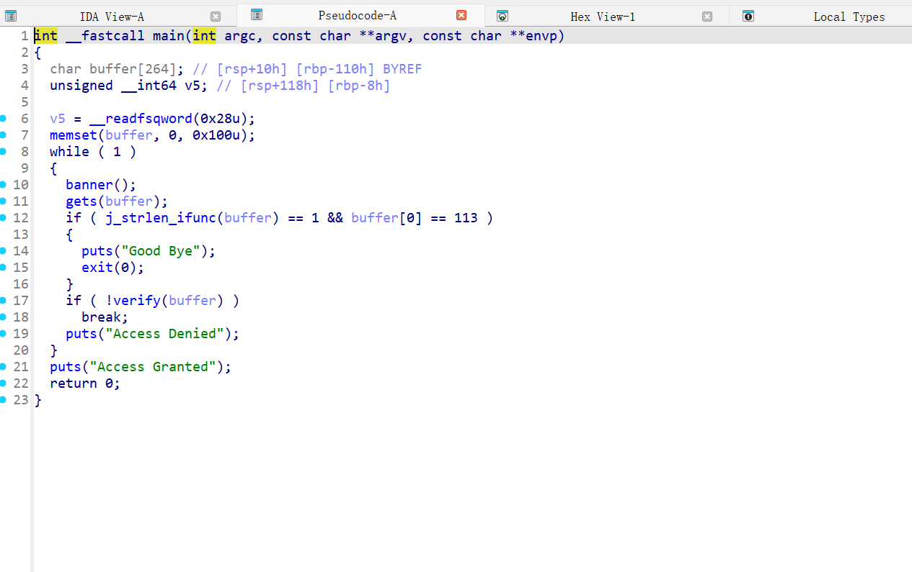

# Reverse

## 程序编译和执行

### 编译 VS 汇编

反汇编（准确，查表）
反编译（不准确）

### 编译（汇编） VS 链接

链接：目标文件->可执行文件

### gcc编译

仅预处理； 不要编译、汇编或链接
gcc -E hello.c -o hello.c.i

只编译； 不要汇编或链接
gcc -S hello.c

编译和汇编，但不链接。
gcc -c hello.c

编译、汇编和链接
gcc hello.c -o hello

## 工具使用和例题讲解

### IDA pro

反编译! :F5

## z3-solver

python函数

## 代码混淆和壳