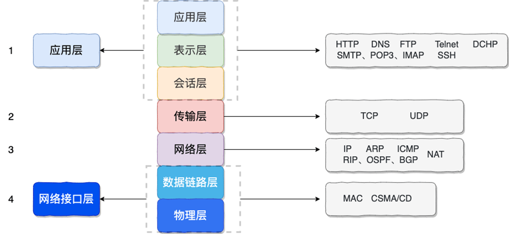

# Web

## 基础知识

### 通信原理

#### 网络基础知识

##### Sever-Client架构

##### 数据包（抓包Burpsuite）

层级分装 与内容无关

##### TCP/IP四层模型 三次握手

data->TCP包->IP包->以太网包
应用层 传输层 网络层 网络接口层

##### 网际协议：IPv4，IPv6（IP）

127开头回环地址 127.0.0.1
0.0.0.0本机的ip(监听)

NAT协议：内网IP主机共享一个公网IPv4

DNS服务（应用层的协议）：域名->IP

//网络层

##### 端口：多路复用

443 永恒之蓝
3389 远程桌面

`netsta -ano`查看端口

##### TCP和UDP

TCP：字节流，可靠
UDP：低开销
//传输层

##### HTTP

格式：
start line
Headers
empty line
body

响应（status-code）：
1xx 信息响应-请求已接收，正在继续处理
2xx 成功-请求已成功接收、理解并接受
3xx 重定向-需要采取进一步的措施以完成请求
4xx 客户端错误-请求包含语法错误或无法完成
5xx 服务器错误-服务器未能完成明显有效的请求

#### 前后端入门

php：服务端语言

能看懂就行hhhh

html 

前端语言，真不难。还要会JavaScript，，

好好学burpsuite（hhhh）。

### 前端后端漏洞

#### 逻辑漏洞

注册，支付，修改密码，信息查询。“审计”

##### 支付漏洞

为了节约成本，会带有price参数来控制需要付多少钱。可通过抓包修改某特定参数值修改支付金额，涉及第三方平台。

##### 越权漏洞

越权修改

#### 注入漏洞

重要重要

##### SQL注入

SQL指令的不当拼接+解析
（lab0-2不算分芜湖）

##### XXE注入

XML的不当拼接+解析 （doc，pdf，jpg）

#### SSRF

#### XSS

##### 存储型XSS

数据被存储在服务器上，用户访问服务数据被自动投送/触发

##### 反射型XSS

数据没有被存储在服务器上，在传参时给出(通常依靠链接传播)

#### CSRF

CSRF token